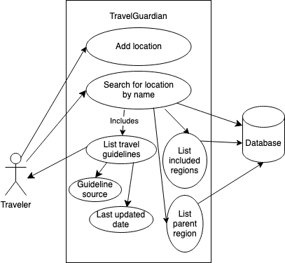

# PROJECT Design Documentation

> _The following template provides the headings for your Design
> Documentation.  As you edit each section make sure you remove these
> commentary 'blockquotes'; the lines that start with a > character
> and appear in the generated PDF in italics._

## Team Information
* Team name: Group 6
* Team members
  * Lucille Blain  
  * Vanessa Nava-Camal
  * Owen Racette
  * Sedria Thomas

## Executive Summary

Travel Guardian aims to educate and protect travelers by aggregating government and tourism travel guidelines with real experiences from other tourists and locals for every destination in the world. Users will begin by selecting a location within the webapp. Next, the user can view up-to-date travel guidelines, such as visa or vaccine requirements. They can also view reports from other users that discuss recent events from that location, as well as post their own questions. 

## Requirements

This section describes the features of the application.

### Definition of MVP
The MVP for Travel Guardian will focus on core features that provide travelers with essential safety information and real-time alerts. It will include:

  1. Travel Guidelines Aggregation – Users can view up-to-date travel guidelines for a selected destination, sourced from official government and tourism websites.
  2. Incident Reporting – Travelers can submit, modify, and view safety incident reports at various locations.
  3. Real-Time Alerts – A notification system for travel advisories and safety warnings in marked destinations.
  4. Emergency Hotkey System – A quick alert feature for travelers to notify emergency contacts.
  5. Safety Heat Map – A visual representation of safety risks using collected data from government and tourism agencies.

### MVP Features
1. Viewing Travel Guidelines
As a traveler, I want to check all national, regional, and local travel guidelines in one place before trips, so I can safely travel to new destinations.

   a. Users can view travel guidelines for a specific destination.
   b. Guidelines from all encompassing regions (national, regional, local) will be included.
   c. Duplicate guidelines will be aggregated for clarity.
   d. Each guideline will include sources with links for verification.
   e. A last updated date will be displayed to ensure users receive current information.
   
2. Reporting Incidents
As a traveler, I want to report incidents that happen while traveling, so I can inform others about dangers and help them travel safely.

   a. Users can submit incident reports including location, description, and relevant tags.
   b. Users can modify reports to add more details.
   c. Users can remove their reports if necessary.
   d. Travelers can view all incident reports for a destination based on location.
   
4. Gathering Travel Guidelines
As a traveler, I want all travel guidelines for my destinations to be aggregated and analyzed from official government sources frequently, so my travel information remains up to date.

   a. Travel guideline data will be collected from official government and tourism websites.
   b. Data will be stored and structured for easy searching and retrieval.
   c. Data collection will respect rate limits and robots.txt policies.
   
5. Filtering Travel Guidelines
As a traveler, I want to filter travel guidelines based on my specific needs and concerns, so I can quickly find relevant information.

   a. Users can filter guidelines by health, visas, and safety-related information.
   b. Users can select guidelines for specific regions or encompassing areas.
   
6. Guidelines Updates & Notifications
As a traveler, I want to receive notifications when travel guidelines are updated, so I can stay informed before my trip.

   a. Users can mark/unmark destinations for upcoming trips.
   b. Users can set common travel destinations to receive ongoing updates.
   c. Notifications will be sent when a marked destination receives new travel updates.
   
7. Community Discussion Posts
As a traveler, I want to post questions to locals about my current, past, or upcoming trip.

   a. Users can create discussion posts under a specific city.
   b. Users can tag other travelers in discussions for responses.
   
8. Emergency Alert System
As a solo traveler, I want to share my location with selected contacts, so they know I’m safe and where I am.

   a. Users can share their real-time location with trusted contacts.
   b. Users can send direct alerts to selected contacts in case of an emergency.
   c. Selected contacts can view an up-to-date location of the traveler.
   
9. Travel Companion Matching
As a solo traveler, I want to connect with others who may want to join my travels, so I can feel safer and share expenses.

   a. Users can create travel companion posts to find potential partners.
   b. Travelers can view posts, comment, and send direct messages to others.
   c. Users can set preferences for ideal travel companions (e.g., gender, interests, budget).
   
10. User Profiles & Messaging
As a user, I want to create a personal profile to connect with others on the platform.

   a. Users can set a profile picture and short bio (including name, age, location, social media, and places traveled).
   b. Users can choose to make their profile public or private for privacy control.
   c. A messaging system will allow travelers to connect and communicate.
   
11. Travel Safety Heatmap & Advisory Map
As a user, I want to quickly view a heatmap of the world to identify areas with high safety risks or travel advisories before booking my trip.

   a. A heatmap will display safety risks and travel advisories globally.
   b. Data will be collected from local and international government and tourism agencies.
   c. The map will include zoom and touch navigation for better exploration.

## Architecture and Design

This section describes the application architecture.

### Software Architecture
> _Place a architectural diagram here._
> _Describe your software architecture._

### Use Cases
##### Viewing Guidelines (8)
As a traveler, I want to be able to check all national, regional, and local rules and travel guidelines in one place before trips, so that I can safely travel to new destinations.

##### Reporting Incidents (5)
As a traveler, I want to be able to report incidents that happen while traveling, so that I can inform others about dangers and help them better travel safely. 

##### Gathering Guidelines (8)
As a traveler. I want all travel guidelines for my destinations to be aggregated and analyzed from official government sources frequently, so that my travel information is informative and up to date.

##### Filtering Guidelines (3)
As a traveler, I want to filter travel guidelines based on my specific needs and concerns, so I can quickly find relevant information.

##### Guideline Updates (3)
As a traveler, I want to receive notifications when travel guidelines are updated, so that I can stay informed before my trip.

##### Discussion Post (5)
As a traveler I want to be able to leave a note to ask a local a question about my current, past, or upcoming trip.

##### Alert System (3)
As a solo traveler, I want to share my location with others, so they can know I’m safe and where I am currently located.

##### Travel Companion (3)
As a solo traveler I want to be able to connect with others who may want to join my travels so that I can feel safer and save expenses that can be split.

##### User Profile (5)
As a user I want to have an all encompassing profile so that I can connect with other users on the platform.

##### Travel Advisory Map / Safety Spike (5)
As a user I want to be able to quickly view a heat map of the world so I know which areas have a high safety risk or travel advisory before I book my trip.

